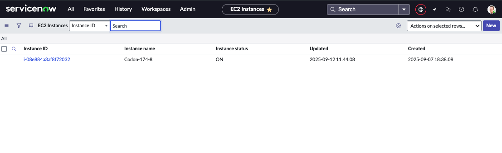
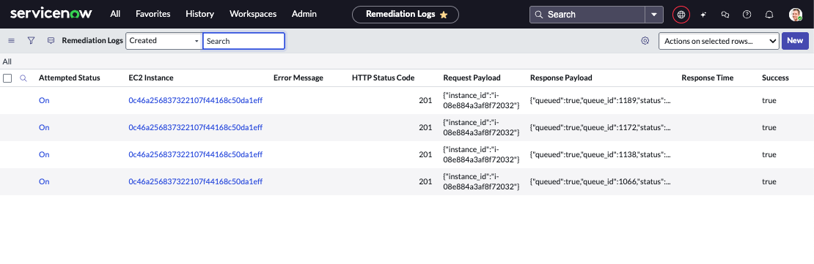
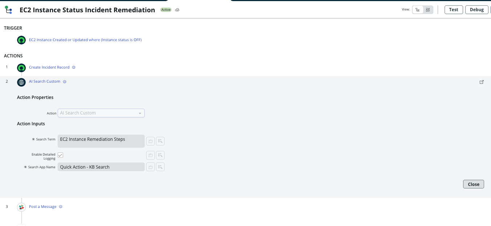
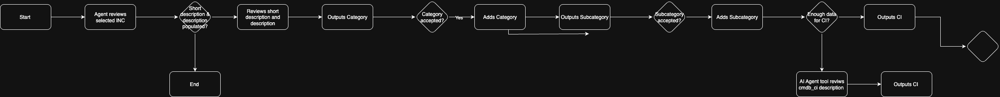
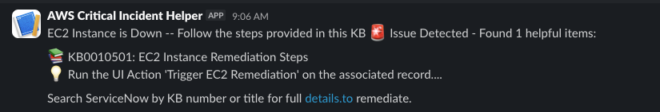

# ec2-remediation-system

## System Overview

### The EC2 remediation system was put in place to help notify and provide action steps to the DevOps team when the AWS Server goes down. Previously this incident response did not exist in which case when it went down there was depredated service for a period of time to customers without IT’s knowledge, potentially costing the company valuable customers. 

### By implementing this remediation system, there is an integration between the AWS Server and ServiceNow and when the server goes offline it is logged into tables in ServiceNow which will then trigger a workflow to notify DevOps and provide the appropriate remediation steps. 

## Implementation Steps

### As partially described in the overview, first an integration was necessary between the AWS Server and ServiceNow. The steps are laid out below:
#### 1. Creating a custom application with two tables to track the status and logs of the AWS Server
#### 2. Connecting the application to the AWS server by HTTP and an authentication method of Basic Authentication using our Admin credentials. 

#### 3. Create a script includes and UI Action button to run it. This script would trigger when the UI Action button is selected to send back to the AWS Server and turn it back on. 
#### 4. Validate that the connection is functioning as expected with testing. 

### The next step involved determining how to notify the DevOps team  when the Server was down and how to go about remediating. The following steps were deployed: 

#### 1. Create a Flow that is triggered when the table logs the server is down (OFF) and create an incident ticket for tracking and report purposes. 
#### 2. Utilize an AI Search action to find the appropriate KB article with the remediation steps.
#### 3. Send the identified KB article to the DevOp engineers via slack so it is received timely and action can be taken immediately. 

## Architecture Diagram

## Optimization

### To optimize this process I would in the Slack message include two URLs, one allowed the DevOps Engineers to go directly to the KB article to read all necessary details as only a small excerpt of text is included and secondly a URL directly to the EC2 Instance where they could immediately select the UI Action button. 

## DevOps Usage

#### 1. Log into the ServiceNow-company.com system 
#### 2. Select All from the filter navigator
#### 3. Search EC2 Instance > EC2 Instances
#### 4. Open the application
#### 5. Select “Trigger EC2 Remediation” button. 

